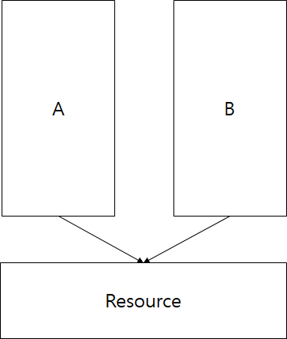
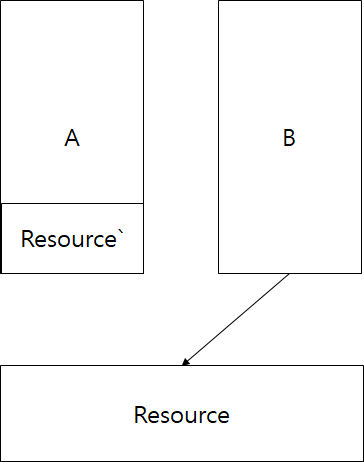

# Immer 분석

## This repo is for studying immer library

관련 정보

- COW(Copy on Write)
- Proxy, getter, setter
- Symbol
- Structual sharing
- Freeze

    </img>
    

        A, B 프로세스가 Resource를 공유하고 있습니다.
         
        만일 A 프로세스가 Resource의 내용을 수정한다면
         
        이를 사용하고 있는 B 프로세스에도 영향이 가게됩니다.
    

    </img>
    

        따라서 이런 경우를 방지하기 위해 쓰기를 수행해야 한다면
         
        A 프로세스에서는 Resoucre의 복사본을 만들어서 사용 한다는게 COW입니다
    

 
immer 분석 Proxy pattern 이용

기본적으로 Javascript built-in 함수들을 사용중 Proxy나 Array.prototype.slice(얕은 복사 용도)를 사용중

base와 nextState는 공유 구조를 가지고 있다. 변경되는 부분은 새로 만들지만 변경되지 않는 부분은 서로 공유하고 있다.

맨 처음 base에 대한 proxy를 만들고 이에 대한 변경이 일어나면 proxy가 내부적으로 변경이 일어나는 애의 또 다른 proxy를 만들면서 진행즉 필요한 애들만 얕은 복사와 proxy를 이용해서 값을 업데이트 중

참고 사이트

- talkingaboutme.tistory.com/entry/Study-Copy-On-Write-COW // COW
- www.youtube.com/watch?v=PljDdK3uT_Q&t=2042s // immer 분석
- hacks.mozilla.or.kr/2016/03/es6-in-depth-proxies-and-reflect/ // Proxy
- www.ecma-international.org/ecma-262/6.0/index.html#table-5 // js spec
- https://github.com/microsoft/vscode-recipes/tree/master/debugging-jest-tests // jest test debugger setting
